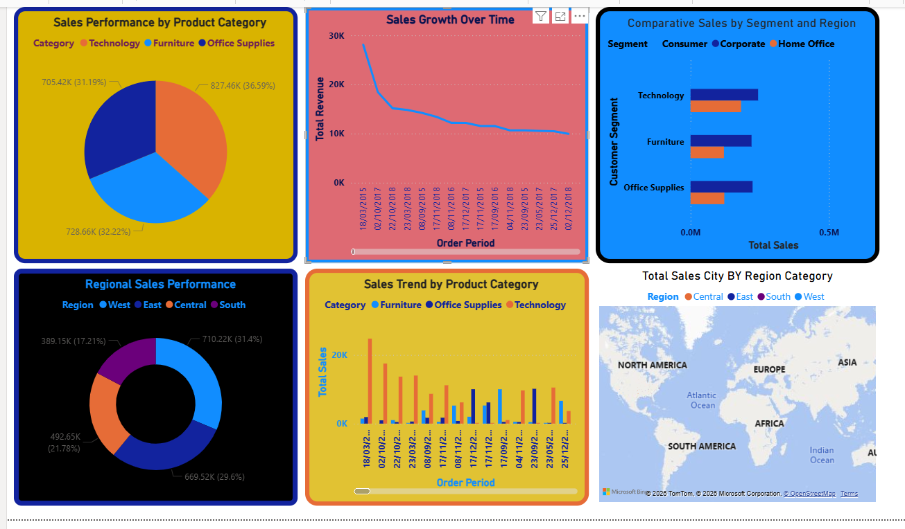

# Superstore-Sales-Insight-Analysis-Dashboard
🔍 Key Business Insights      ​Category Performance: Technology leads in revenue, indicating high market demand.     ​Sales Trends: Seasonal patterns identified, essential for inventory and growth forecasting.     ​Regional Insights: Regional performance variations reveal key opportunities for business expansion and targeted marketing.

### 📊 Superstore Sales Analytics

To me  
Liton Islam

litonislamnext@gmail.com.

  

📝 Project Overview

​This project presents an interactive Superstore Sales Dashboard built with Power BI. The dashboard provides a holistic view of sales performance, analyzing regional distribution, product category trends, and growth patterns to assist in strategic business planning and revenue optimization.
​🔑 Key Features

    ​Sales Growth Tracking: Visualizing total revenue trends over time to identify business cycles.
    ​Regional Insights: A detailed breakdown of sales performance across different geographic regions and cities.
    ​Category Performance: Analysis of product segments (Technology, Furniture, Office Supplies) to determine revenue contributors.
    ​Comparative Analytics: Comparing sales metrics between Consumer, Corporate, and Home Office segments.

​🛠 Tools Used

    ​Power BI: For building the interactive dashboard and complex data modeling.
    ​DAX: Used for calculating performance measures and year-over-year sales comparisons.
    ​Data Source: Superstore Sales Dataset.

​💡 Key Insights

    ​Top Performers: Technology leads in product category revenue, showing high demand.
    ​Regional Disparities: Specific regions show varying levels of engagement, providing opportunities for targeted marketing.
    ​Sales Patterns: Time-series analysis reveals fluctuations in sales volume, highlighting peak periods for inventory planning.
    ​Customer Segmentation: Corporate and Consumer segments drive the majority of the sales volume.

🚀 Explore the Full Analysis on Kaggle:
* 📊[Notebook]https://www.kaggle.com/code/litonislam/superstore-sales-insight-dataset
* 📊[Dataset]https://www.kaggle.com/datasets/litonislam/superstore-sales-insights
